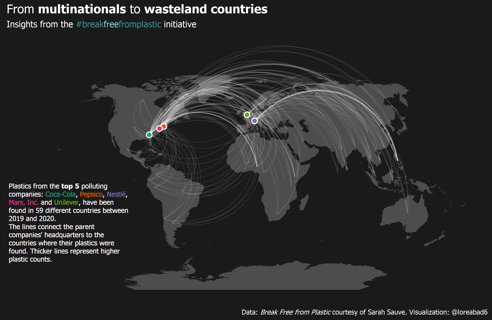

```{r setup, include=FALSE}
knitr::opts_chunk$set(echo = TRUE)
```

## 2021

### Week 11


Code to reproduce:
[week_11.Rmd](https://github.com/loreabad6/TidyTuesday/blob/master/R/2021/week_11.Rmd)

### Week 05

To create this plot I used the [`sfnetworks`](https://luukvdmeer.github.io/sfnetworks/) package in combination with [`ggraph`](https://ggraph.data-imaginist.com/). I am writing an entry that illustrates the first steps of integrating both packages! I will link it here when it is ready!

 

Step by step code for data prep and viz: [week_05.md](https://github.com/loreabad6/TidyTuesday/blob/master/R/2021/week_05.md)

## 2020

### Week 41

 

Code to reproduce: [week_41.Rmd](https://github.com/loreabad6/TidyTuesday/blob/master/R/2020/week_41.Rmd)

### Week 39

 

Code to reproduce: [week_39.Rmd](https://github.com/loreabad6/TidyTuesday/blob/master/R/2020/week_39.Rmd)

### Week 38

 

Code to reproduce: [week_38.Rmd](https://github.com/loreabad6/TidyTuesday/blob/master/R/2020/week_38.Rmd)

### Week 37

 

Code to reproduce: [week_37.Rmd](https://github.com/loreabad6/TidyTuesday/blob/master/R/2020/week_37.Rmd)


