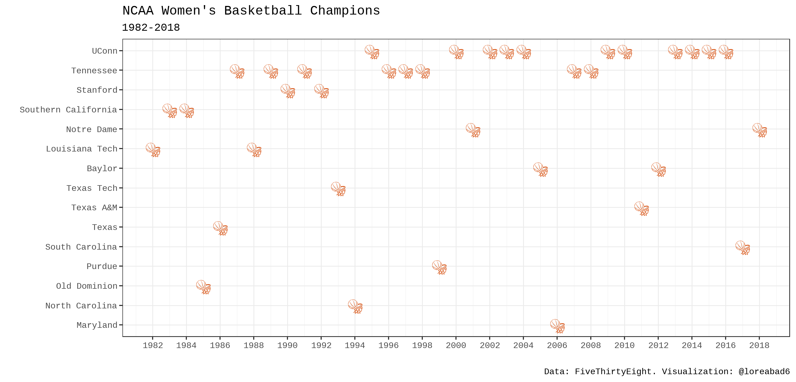
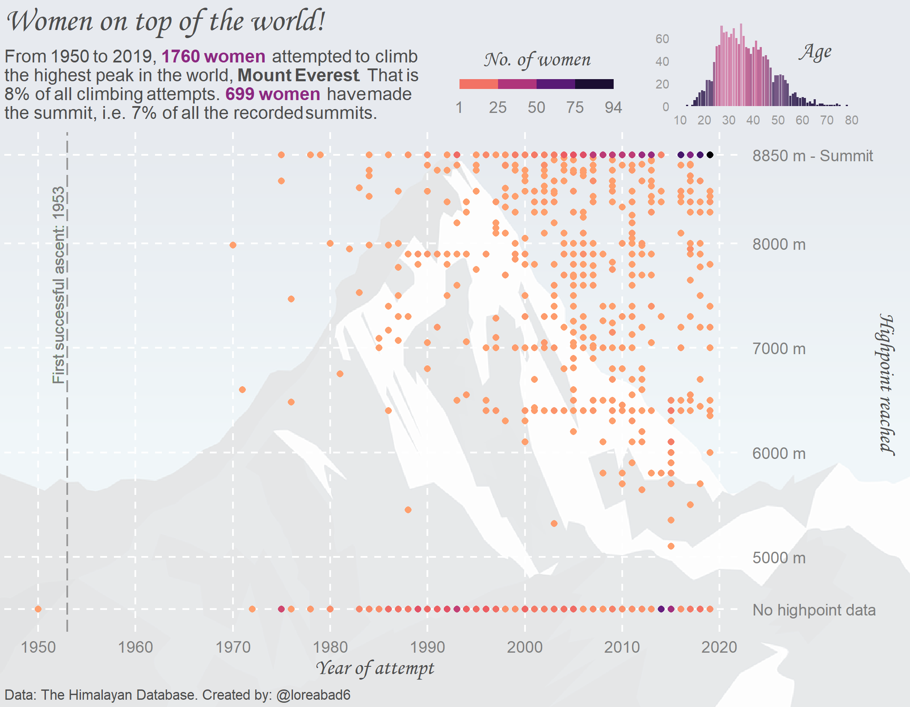
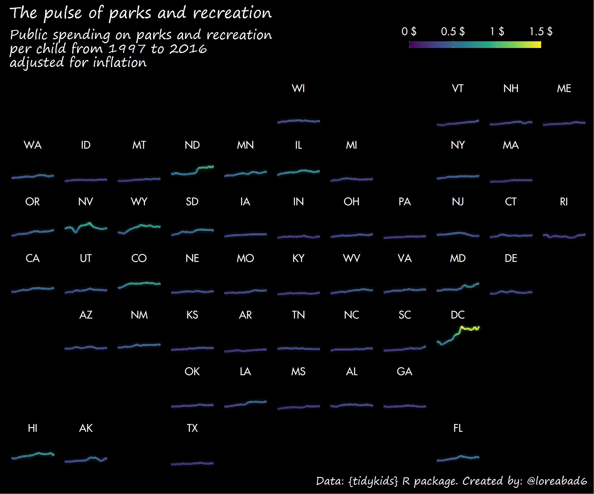

Tidy Tuesday contributions
================

## 2021

### Week 05

To create this plot I used the
[`sfnetworks`](https://luukvdmeer.github.io/sfnetworks/) package in
combination with [`ggraph`](https://ggraph.data-imaginist.com/). This
[blog]() I wrote illustrates the first steps of integrating both
packages!

Simplified code to reproduce the plot:
[week\_05.Rmd](https://github.com/loreabad6/TidyTuesday/blob/master/R/2021/week_05/week_05.Rmd)

## 2020

### Week 41

Code to reproduce:
[week\_41.Rmd](https://github.com/loreabad6/TidyTuesday/blob/master/R/2020/week_41.Rmd)

### Week 39

Code to reproduce:
[week\_39.Rmd](https://github.com/loreabad6/TidyTuesday/blob/master/R/2020/week_39.Rmd)

### Week 38

Code to reproduce:
[week\_38.Rmd](https://github.com/loreabad6/TidyTuesday/blob/master/R/2020/week_38.Rmd)

### Week 37

Code to reproduce:
[week\_37.Rmd](https://github.com/loreabad6/TidyTuesday/blob/master/R/2020/week_37.Rmd)
